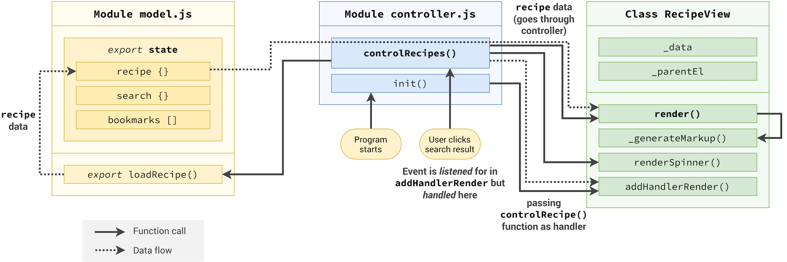
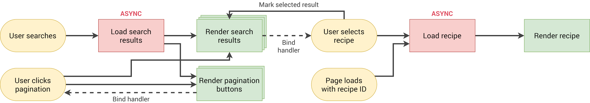
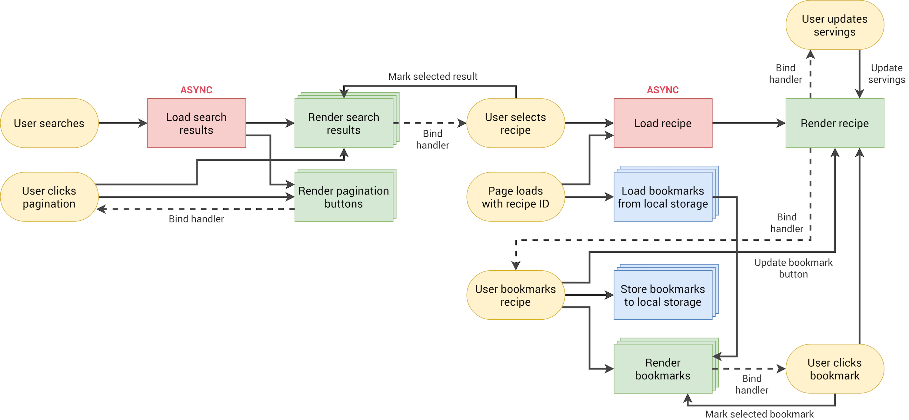
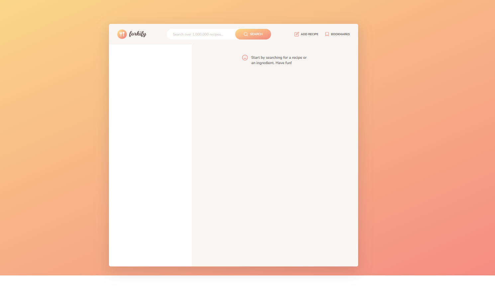
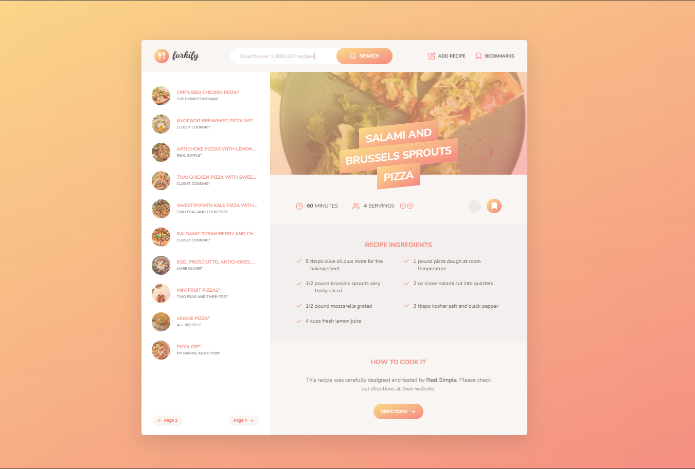
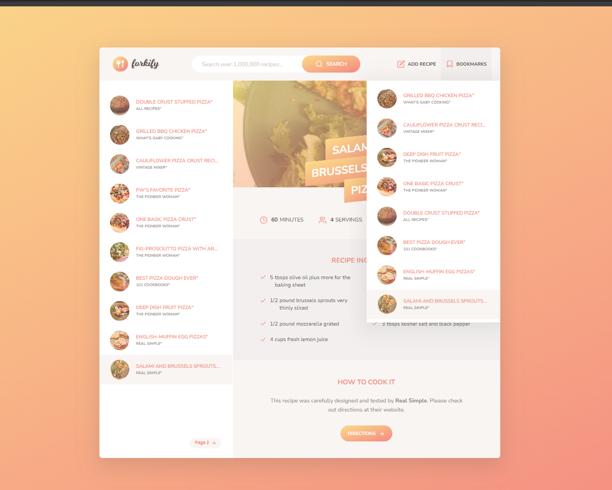

# 🍽️ Forkify – Recipe Application

## 🚀 Overview

Forkify is a modern JavaScript-based recipe application that allows users to search, view, and manage recipes through an intuitive and responsive interface. The application fetches real-time recipe data from an external API and renders it dynamically.

This project demonstrates advanced frontend development concepts such as modular JavaScript architecture, state management, API integration, and performance optimization using a modern build tool.

---

## ✨ Features

- 🔍 Search recipes from external API
- 📖 View detailed recipe information
- ⚖️ Adjust servings dynamically
- 📌 Bookmark favorite recipes
- 🔄 Pagination for search results
- ⚡ Fast performance with Parcel bundler
- 📱 Responsive design for all devices

---

## 🛠️ Tech Stack

### Frontend

- HTML5
- CSS3 / Sass
- JavaScript (ES6+)

### Tooling

- Parcel (Bundler)
- Babel (via Parcel)

### Libraries

- core-js (JavaScript polyfills)
- regenerator-runtime (async/await support)
- fraction.js (ingredient quantity calculations)

---

## 📁 Project Structure

```
forkify/
│
├── index.html
├── src/
│   ├── js/
│   ├── sass/
│
├── screenshots/
├── docs/
│
├── package.json
└── README.md
```

---

## ⚙️ Installation & Setup

### 1️⃣ Clone the repository

```
git remote add origin https://github.com/yashodipdeore/Forkify.git
```

### 2️⃣ Install dependencies

```
npm install
```

### 3️⃣ Run development server

```
npm start
```

Application will run on:

```
http://localhost:1234
```

---

## 🏗️ Build for Production

```
npm run build
```

This generates an optimized `dist/` folder ready for deployment.

---

## 🏗️ Architecture

<p align="center">
  
</p>

---

## 🔄 Application Flow

<p align="center">
  
</p>

<p align="center">
  
</p>

<p align="center">
  
</p>
---

## 📸 Screenshots

### 🏠 Home Page

<p align="center">
  
</p>

### 🔍 Search Results

<p align="center">
  
</p>

### 📖 Recipe Details

<p align="center">
  
</p>

---

## 🔌 How It Works

1. User enters a search query
2. Application sends request to recipe API
3. API returns recipe data
4. Data is processed and rendered in UI
5. User can bookmark recipes and adjust servings

---

## 🔒 Best Practices Implemented

- Modular JavaScript (MVC pattern)
- Separation of concerns
- Reusable components
- Efficient state management
- Clean and maintainable code structure

---

## 🎯 Future Improvements

- User authentication system
- Upload custom recipes
- Real-time updates
- Progressive Web App (PWA) support
- Mobile app version (React Native / Kotlin)
